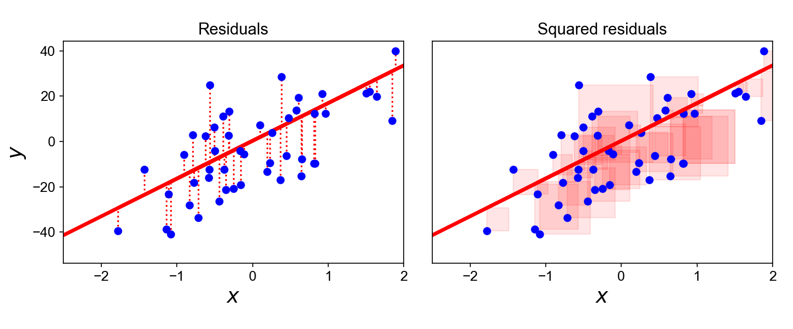
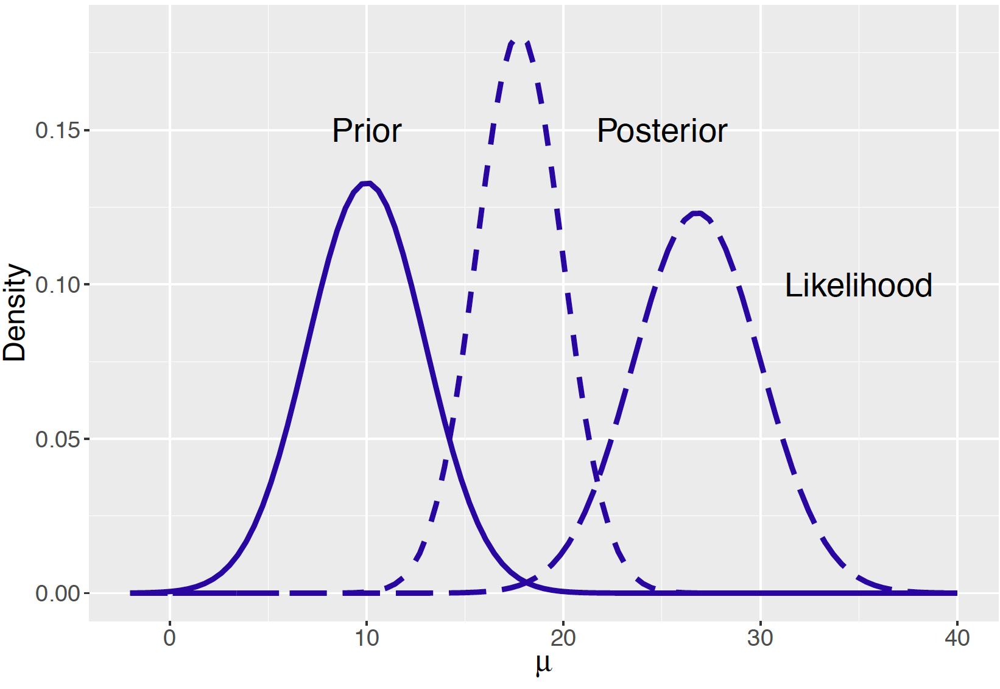

```{r}
#| lst-label: lst-r-libraries
#| lst-cap: "R libraries"

base::library(package = magrittr) # For advanced pipe functionality
base::library(package = sessioninfo) # For technical info

# Write all package citations to bib file for citation
knitr::write_bib(
  x    = base::.packages(),
  file = "./refs/r_packages.bib"
)
```

```{bash}
#| lst-label: lst-citing
#| lst-cap: "Bibliography and citations"

# Check if a complete bib file already exists
if [ -f ./refs/complete.bib ]; then
  rm ./refs/complete.bib
fi

# Make an empty bib file
touch ./refs/complete.bib

# Append R package citation to bib file
if [ -f ./refs/r_packages.bib ]; then
  cat ./refs/r_packages.bib >>./refs/complete.bib
fi

# Add any additional citations to bib file
if [ -f ./refs/refs.bib ]; then
  cat ./refs/refs.bib >>./refs/complete.bib
fi
```

```{r}
#| lst-label: lst-knitr-opts
#| lst-cap: "Knitr options"

# Make NAs show as - in tables
base::options(knitr.kable.NA = "-")
```

```{r}
#| lst-label: lst-seed
#| lst-cap: "Set seed"

# Set seed for reproducability on sampling and bootstrapping
base::set.seed(seed = 123)
```

# Introduction

::: {.content-visible when-format="html"}

## Follow Along {#sec-follow-along}

{width=60%}

<http://bit.ly/49UzDFF>

:::

## About Me {#sec-about-me}

- **Education**
  - B.S. in Psychology (Neuroscience Concentration) from Calvin University
  - M.S. in Quantitative Psychology from Ball State University
- **Current Positions**
  - Lead Psychometrist at Trinity Health West Michigan Medical Group -
    Neuropsychology Department
  - Adjunct Professor of Psychology at Grand Valley State University
  - Adjunct Instructor of Educational Psychology at Ball State University

## Disclosures & Disclaimers {#sec-disclosure}

- I have no financial disclosures or conflicts-of-interests related to this
  presentation
- This presentation has not been drafted, ideated on, or edited with use of AI
  or LLMs. Any mistakes made are human error.
- CE credits for viewing this presentation will be provided after the conclusion
  of the conference and completion of the post-conference survey

## Acknowledgments {#sec-acknowledgments}

- To the National Association of Psychometrists (NAP) Conference Planning
  Committee and all organizers of this conference
- To my colleagues, Amelia VanderLeest and Blair Shaw
- To the other presenters, before and after me
- To you, my audience

## Learning Objectives {#sec-objs}

*Learning objectives below have been approved by NAP and the Board of Certified
Psychometrists (BCP). These objectives will be met with an emphasis on relevancy
to the discipline of psychometry. These objectives are written for an audience
of psychometrist with at least an undergraduate degree containing at least one
course on statistics and/or quantitative methods.*

- Learn the general, basic differences between the frequentist and Bayesian
  frameworks for statistics
- Review the historical and modern prevalent use of frequentist statistics in
  neuropsychology and cognitive testing
- Appreciate the various developing applications of Bayesian statistics to
  neuropsychological evaluation - Consider the practical ramifications in test
  selection and scoring that come with a Bayesian perspective, along with the
  possible future directions for this approach
- Understand the limitations and ramifications of implementing these methods in
  a clinic

## My Pitch {#sec-my-pitch}

- Empirical and evidence-driven nurse analogy
  - We owe it to our patients and clinics to be well-versed in empirical
    knowledge, even if not used daily
- Improving our stature, variety, skills, and critical thinking
  - With an ever-evolving landscape involving digital testing, AI, and new
    technology, we must be mindful of how we can train ourselves up in new
    methods, many of which have roots in Bayesian statistics
- Becoming skilled in statistics may offer an important avenue to future
  research and educational opportunities!

# Illustrative Examples {#sec-illustrative-examples}

## A Funky Plane Ride {#sec-funky-plane-ride}

- Patrick is scheduled for a plane ride to go to his favorite conference in the
  humid city of Baltimore. But he's a nervous flyer...

- Patrick overthinks, and begins to wonder if he is at risk of a plane crash due
  to weather conditions.
  - 1 in 816,545,929 or 0.000001% chance of dying in a plane crash (The odds of
    winning the Powerball Jackpot are 1 in 292,200,000)
  - In the following scenario, raise your hand at which you think a plane crash
    is more than 1% likely to happen

1. Patrick hears there has been a last minute change in flight captain, to a
   Capt. Tentacles
2. Patrick hears that a flight at the gate next to him has been prevented from
   landing due to poor weather conditions obstructing landing
3. Patrick hears from his friend, Sandy, that severe thunderstorms are forming
   in the path of his travel
4. While boarding Patrick notices a sizable teams of mechanics and flight staff
   looking up into the lower part of the plane, pointing, and arguing
5. While in flight, the plane begins to not only experience major bumps and
   drops, but also severe crosswinds
6. As he grips his armrests, the person next to him, Sheldon (who is a flight
   veteran of 15 years) says this is the worst turbulence he's ever experienced

- What is the chance that, after all of this, Patrick's plane crashes?
  - The thought process you employed in this exercise follows the logic of the
    Bayesian model

{.fragment}

## A Questionable Patient {#sec-a-questionable-patient}



- Fran is a woman concerned for her memory, presenting to the neuropsychology
  clinic for assessment. She is worried that she may be developing dementia.

- When she comes in, her neuropsychologist, Dr. Sheffield considers the
  possibilities and explains why they have to do some tests to get answers
  - Based upon demographics and an informed guess Dr. Sheffield initially
    believes there is a 10% chance of dementia in this patient. She hands off to
    his psychometrist, Bryton, for cognitive testing
  - In the following scenario, raise your hand at which you think there is a
    greater than 30% chance that Fran will be diagnosed with dementia

1. Fran misses 1 point on orientation questions, she's off by one on the date,
   and says she doesn't pay attention because she is retired
2. Bryton notices that he has to repeat himself often and asks if Fran wears hearing
   aids, she says no, her hearing is fine, he just needs to be more clear when
   he speaks
3. Bryton records a score on the HVLT (a word memory test) that put's Fran's
   delayed recall at 0% retention, and a exceptionally low standardized free
   recall score.
4. Bryton then administers TFLS (an ADLs/functional living test) and Fran, once
   again, score exceptionally low in all domains. She becomes frustrated, asking
   why she has to do these.
5. Bryton has to switch out with Grace, his coworker, as he doesn't know how to
   give one of the tests Dr. Sheffield has assigned. Grace administers a WMS-5
   Logical Memory (a story memory test) and, once again, records an
   exceptionally low standardized recall score.

- If you didn't raise your hand, what other explanations might explain Fran's
  condition?
  - Again, with weighing this evidence, you employ a mindset in line with the
    Bayesian model

# Frequentist vs. Bayesian {#sec-frequentist-vs-bayesian}

## Review of Frequentist Statistics {#sec-review-freq}



-  is a framework of statistics build on
  the belief that  is defined as long-run frequency, or relative
  frequency over an infinite number of trials
  - Simple example: if I were to flip a fair coin an infinite number of times,
    it would land on head 50% of the time
  - More complex example: if I were to gather an infinite number of samples from
    a specified population of US people, the relativity frequency of them
    having epilepsy would be 1.1% [@kobauActiveEpilepsyPrevalence2023]

- Connection to statistics (as we are used to seeing)
  - $p = 0.02$ () in a comparison between group A and group B on scores on a standardized
    test
  - Frequentist interpretation: under the assumption that the null hypothesis is
    true, there is a 2% chance of this difference having randomly occurred in an
    infinite number of comparisons from these two populations
  - Practical conclusion: if $\alpha = 0.05$, then we can provide evidence that
    the null hypothesis that these two populations have the same test scores

- Whether you remember it or not, this was almost certainly the way you learned
  statistics the first time!

## Introduction to Bayesian Statistics {#sec-intro-bayes}

-  is a
  framework of statistics built up the belief that probability is the degree of
  belief of an event
  - Simple example: Initially, I think that the dice are fair, and there is a
    1/6 chance of rolling a 6, however, after learning the dice are rigged, I
    believe that the chance of rolling a 6 are 1/36.
  - Complex example: Upon arriving at the clinic, I believe a person who is 71+
    years old has a 13.9% chance of being diagnosed with dementia due to base
    rates [@plassmanPrevalenceDementiaUnited2007]. However, after passing
    several functional and memory measures I believe they only have a 4% chance
    of being diagnosed with dementia

- Bayesian statistics are rooted in use of , that describes the process
  of updating the degree of belief based upon new information. It is:

$$
P(A | B) = \frac{P(B | A)*P(A)}{P(B)}
$$

- Where:
  - $A$ and $B$ are both events; $B$ in particular can be thought of as "new
    evidence"
  - $P(A)$ is the probability of event $A$ occurring; also called the 
  - $P(B)$ is the probability of event $B$ occurring
  - $P(A | B)$ is the probability of $A$, given $B$ is true; also called the 
  - $P(B | A)$ is the probability of $A$, given $B$ is true; also called the 

- Effectively, Bayes Theorem is all about how we update our degree of belief in
  $A$, given evidence $B$. This may be a brand new way to think about
  probabilities for you!

- From the [Illustrative Examples] earlier:
  - Prior or $P(A)$ of 10% of dementia
  - Additional pieces of evidence modifying that likelihood are $B$
  - The "hand raise" benchmark of 30% was a description o $P(A | B)$, also know
    as the posterior probability



## How They Differ {#sec-differ-methods}

- Frequentist statistics are rooted in describing long-run frequency and
  probabilities of certain events occurring by considering an infinite number of
  trials

- Bayesian statistics are about modifying degree of belief in a certain outcome
  given new information

- Furthermore, Frequentist models assume fixed model parameters, while Bayesian
  methods treat parameters as a distribution and random, reflecting our
  uncertainty about the prior data



- For a more robust description of the long-running debate, see
  @bayarriInterplayBayesianFrequentist2004

# Prevalent Use of Frequentist Statistics {#sec-frequentist-stats}

## Examples of Frequentist Statistics {#sec-ex-freq}

### In Concept {#sec-concept-freq}

- , ,  - any parametric model that produces a
  p-value, as the p-value itself is a judgment of long-run frequency or
  probability of the event being "real"

- Due, to their  nature, tests like $\chi^2$ don't
  mesh as well with the definition of frequentist, but the production of the
  p-value still means they do!

### In Research {#sec-research-freq}



- To use some brief examples from recent NAP journal clubs:
  - @whitakerAssessingLearningMemory2024 used several t-tests and chi-square
    tests when determining if there were significant differences in brain cancer
    patients on the CVLT-C and the ChAMP.
  - @vyhnalekOlfactoryIdentificationAmnestic2015 used ANOVA, $\chi^2$ tests, and
    linear regression to identify differences in Olfaction between several
    different MCI groups

- In both prior examples, the frequentist models were used to answer questions
  about comparing groups to one another and the likelihood of them being as
  different as they were, if the null was true.

### In Clinic? {#sec-clinic-freq}

- Frequentist methods usually require multi-person samples for analysis, so it's
  use is limited at the single sample level

- However, one use is in the generation of a p-value for a  on forced choice
  performance validity tests, like the VSVT [@reschVictoriaSymptomValidity2021]

## Benefits of Frequentist Statistics {#sec-benefits-freq}

- As the longstanding predominant statistical method for the last 100 years
  [@efronBayesiansFrequentistsScientists2005], frequentist statistic enjoy wide
  acceptance as suitable evidence for backing claims of impact and differences

- These analyses provide concrete statements about the likelihood of a  in judgment
  occurring - in the form of the p-value

- Practical in studying groups, and relatively simple to interpret and draw
  conclusions from

## Drawbacks of Frequentist Statistics {#sec-drawbacks-freq}

- Limited usefulness in small-n sizes or single-case studies, such as when
  analyzing a single patient in a clinical setting

- Continuing problems in p-value misinterpretation and misuse
  [@lakensPracticalAlternativeValue2021]
  - One proposed solution is lowering of the "standard" $\alpha$ value
    [@ioannidisProposalLowerValue2018]



# Applications of the Bayesian Method {#sec-applications}

## Examples of Bayesian Statistics {#sec-ex-bayes}

### In Concept {#sec-concept-bayes}

- The results of a Bayesian analysis are often presented as a set of
  distributions, showing the prior and posterior distributions as being impacted
  by the new evidence

- The most common form of Bayesian-based analysis is rooted in use of something
  called a Monte Carlo Markov Chain (MCMC) algorithm
  - This is the analog to something like the ordinary least squares (OLS) method
    or maximum likelihood method of obtaining estimates, but for Bayesian
    analysis







### In Research {#sec-research-bayes}

- Modeling declines in cognition and/or failures in thinking as a Bayesian
  process with flawed evidence and prior [@parrComputationalNeuropsychologyBayesian2018]

- In same vein as the last point, can we refine or challenge existing theories
  by leveraging more computational methods [@schmerwitzFutureNeuropsychologyDigital2024]

- Proposing a use for Bayesian models that can define "cutoffs" in number of
  tests to define as abnormal or clinically concerning [@gavettValueBayesTheorem2015]

### In Clinic? {#sec-clinic-bayes}

- @scandolaBayesianMultilevelSingle2021 and @crawfordComparisonSingleCase2007:
  both focus on how to do robust comparison of a likely distribution of a person
  with a normative distribution using Bayesian methods.
  - This is similar to how we would use regular normative samples, but has the
    added benefit of capturing the continued uncertainty in a distribution,
    rather than a single point estimate with confidence intervals

- Slow but steady growth in learning and adoption, in response to broader
  concerns around the accuracy and stability of neuropsychological assessment [@huygelierValueBayesianMethods2022]

- Emerging evidence that a well-made Bayesian analysis may provide more specific
  and sensitive results that align well with classification of Alzheimer's
  disease [@goetteValidationBayesianDiagnostic2023]

## Benefits of Bayesian Statistics {#sec-benefits-bayes}

- Still offer the ability to judge someone against a control (healthy) group,
  much like with regular, normative datasets

- Integrates evidence while still maintaining healthy uncertainty about the
  range of outcomes; remember, there is a distribution of a random parameter,
  not a fixed one. Avoids providing a (seemingly) authoritative point estimate

- Instead of starting at a *naive* point, like frequentist testing, Bayesian
  testing leverages information about where a person's distribution may lie as
  the prior

- Can provide predictions of performance, much like a regression model. This may
  offer a more algorithmic approach to evidence integration than clinical
  judgment alone. Data driven and algorithmic medicine has become a very popular
  tool to increase efficiency and accuracy [@topolHighperformanceMedicineConvergence2019]



## Drawbacks of Bayesian Statistics {#sec-drawbacks-bayes}

- Not as widely known or supported by other scientists; less likely to be
  accepted as analysis in papers and presentations

- Relatively difficult to interpret and explain, due to usually more complex,
  computerized calculations and larger, more complicated mathematical formulas.

- Implementation for clinical practice requires well-informed understanding of
  Bayesian models, as selection of appropriate prior distribution is necessary
  - This is similar to a process such as norms selection, e.g., Mitrushina vs.
    Heaton

- Results are not as clear-cut to describe (compared to frequentist results),
  especially to non-scientific audiences

# Conclusion {#sec-conclusion}

## Further Reading & Resources {#sec-further-reading}

- Books
  - For a friendly and more basic introduction to the Bayesian Method
    $\rightarrow$ *A Student's Guide to Bayesian Statistics*
    [@lambertStudentsGuideBayesian2018]
  - For broad coverage of statistics topics leading up to Bayesian Methods
    $\rightarrow$ *Statistical Rethinking, 2nd Edition*
    [@mcelreathStatisticalRethinkingBayesian2020]
  - For more focused applications of Bayesian Methods to psychology
    $\rightarrow$ *Bayesian Statistics for the Social Sciences, 2nd Edition*
    [@kaplanBayesianStatisticsSocial2024]
- Review the [References] of this presentation for scientific articles that show
  these methods in action!
- For more machine-learning examples, check out my [2025 NAP slides on
  advancements in machine learning and AI in
  Neuropsychology](https://qquagliano.github.io/nap_2025_presentation/presentation/presentation.html#/title-slide)

## Take-home Message {#sec-take-home}

- Bayesian statistics differ greatly from frequentist statistics in the framing
  and questioning of probabilities
- While frequentist statistics do remain prominent, advanced methodologists are
  seeing more innovating ways to apply Bayesian methods to success in
  neuropsychological research
- Because of their unique position, Bayes-inspired methods offer a meaningful
  way to pursue new advances in research and clinical thinking
- While innovative, there are still many challenges in practically applying
  these ideas to the daily work of psychometrists
- Consider this: which perspective feels like a better way to represent
  probability, to you?



## Contact Information {#sec-contact-info}

Thank you for your attention today - I welcome you to stay in touch with me to
talk about this topic and other exciting neuropsychology!

- Email: <Quinton.Quagliano@trinity-health.org>
- [Find me on LinkedIn](https://www.linkedin.com/in/quintonquagliano)!
- *If you wish to re-use or cite today's presentation, please follow all
  customary rules on attribution to myself*

Any Questions?

::: {.content-visible when-format="pdf"}

# Additional Information {#sec-addt-info}

## System and Program Information {#sec-system-program-info}

Replicability of this file is dependent on having all necessary system
dependencies. These include, but are not limited to, a TeX distribution, Pandoc,
R, all listed R packages and their dependencies, and many more. Please ensure
that your system is capable of knitting other Quarto documents and running R
code.

Alternatively, the build environment can be replicated using the included nix
flake file, which can replicate the exact TeX, Quarto, and R package versions
used in this analysis. Please see the section on [Reproducability Information].

This work has been version controlled with git, to improve ability to review
history of files. All source code, files needed to reproduce, and .git files
will be included with this document for transparency. The source code used to
generate this document, and it's accompanying presentation, [can be found on
Github](https://github.com/qquagliano/nap_2025_presentation/tree/master).

See @tbl-tech-info for system, R, and package information regarding the system
that this document was originally rendered on.

```{r}
#| label: tbl-tech-info
#| tbl-cap: "Technical Information"
#| tbl-subcap:
#|   - "System and R Information"
#|   - "Packages"
#| layout-ncol: 2
#| output: true

base::R.Version() |>
  base::data.frame() |>
  base::t() |>
  magrittr::set_colnames("Specifications") |>
  knitr::kable()

pkgs <- sessioninfo::package_info(
  pkgs         = base::.packages(),
  dependencies = FALSE
)

base::data.frame(
  package = pkgs$package,
  version = pkgs$ondiskversion
) |>
  magrittr::set_colnames(c("Package", "Version")) |>
  knitr::kable()
```

## Reproducability Information {#sec-reproduce}

Steps have been taken to make this document reproducible and able to be audited.
Prior to attempting the steps in reproducing this work and generated
PDF/presentation, please acquire/install any necessary tools and packages, as
listed in @sec-system-program-info. Because of limitations in testing time, it
cannot be guaranteed that this work is entirely reproducible - please contact
the author using information from the [Contact Information] section to get in
touch if anything seems off.

:::

## References {#sec-refs}

::: {#refs}
:::
